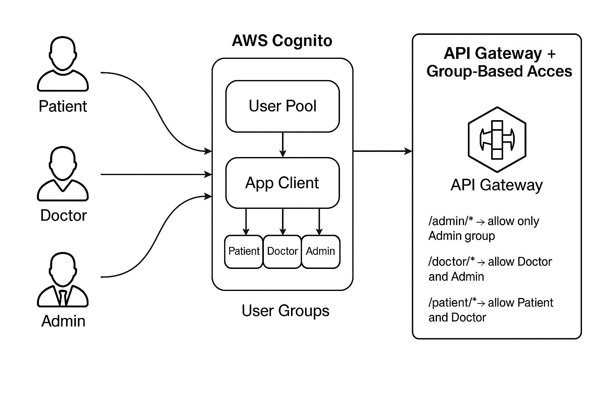

# AWS Cognito Role-Based Auth (Patient / Doctor / Admin)

## 🧪 Features
- Secure User Pool
- App Client with OAuth
- Hosted UI
- Group-based user control
- Sample users (admin, doctor, patient)


## 🚀 Deploy
```bash
terraform init
terraform apply
